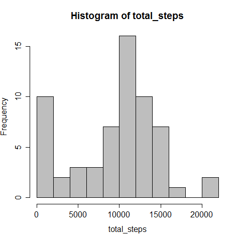

##Loading and preprocessing the data

The data was read as the object "activity" and then, the variable date was converted for a Date format:

```{r}
activity <- read.csv("activity.csv")
activity$date <- as.Date(activity$date)
```

##What is mean total number of steps taken per day?
  
For answer this question, first we have to calculate the total number of steps taken per day. For this, I used the tapply function:

```{r}
total_steps <- tapply(activity$steps, activity$date, sum, na.rm= T)
```

Then, I made a histogram of the total number of steps taken each day:

```{r}
hist(total_steps, breaks = 10, col="gray", xlab="Number of steps")
```
 

The mean and median of the total number of steps taken per day are:

```{r}
mean(total_steps)
median(total_steps)
```

##What is the average daily activity pattern?

A time series plot of the 5-minute interval (x-axis) and the average number of steps taken, averaged across all days (y-axis):

```{r}
daily_pat <- tapply(activity$steps, activity$interval, mean, na.rm= T)
plot(unique(activity$interval), daily_pat, type="l", xlab="5-minute interval",
     ylab= "Number of steps")
```
 

Which 5-minute interval, on average across all the days in the dataset, contains the maximum number of steps?

```{r}
daily_pat[which.max(daily_pat)]
```

##Imputing missing values

The total number of missing values in the dataset is:

```{r}
sum(is.na(activity$steps))
```

For filling in all of the missing values in the dataset I used the mean of the corresponding 5-minute interval, with the following strategy:

```{r}
fill_steps <- integer(nrow(activity))
for(i in 1:nrow(activity)){
        if(is.na(activity$steps[i]) == TRUE) {
                fill_steps[i] <- mean(activity$steps[which(activity$interval==activity$interval[i])], na.rm=T)
        }else{
                fill_steps[i] <- activity$steps[i]
        }                
}
```

Then, I created a new dataset that is equal to the original dataset but with the missing data filled in:

```{r}
activity_fill <- data.frame(steps= fill_steps, date = activity$date, interval= activity$interval)
```

Make a histogram of the total number of steps taken each day and calculate and report the mean and median total number of steps taken per day. 

```{r}
total_steps_fill <- tapply(activity_fill$steps, activity_fill$date, sum, na.rm= T)
hist(total_steps_fill, breaks = 10, col="gray", xlab="Number of steps")
```
 

```{r}
mean(total_steps_fill)
median(total_steps_fill)
```

These values differ from the estimates from the first part of the assignment, because they increased.   
Imputing missing data on the estimates of the total daily number of steps, in this case, can underestimate this number.

##Are there differences in activity patterns between weekdays and weekends?

I created a new factor variable ("week") in the dataset with two levels – “weekday” and “weekend”:

```{r}
activity_fill$week <- factor(ifelse(weekdays(activity_fill$date, abbreviate= T)
                                    %in% c("seg","ter","qua","qui","sex"),
                                    "weekday", "weekend"))
```

Then, I used the dplyr package to summarize the number of steps according the variables "week" and "interval":

```{r, results='hide'}
library(dplyr)
week_group <- group_by(activity_fill, week, interval)
avg_step <- summarize(week_group, step= mean(steps))
```

With the summrized dataset, I made a panel plot containing a time series plot of the 5-minute interval (x-axis) and the average number of steps taken, averaged across all weekday days or weekend days (y-axis):

```{r}
library(lattice)
xyplot(step ~ interval | week, data= avg_step, type= "l", layout= c(1,2))
```
 

We can see that on weekdays the number of steps is greater than on weekend.